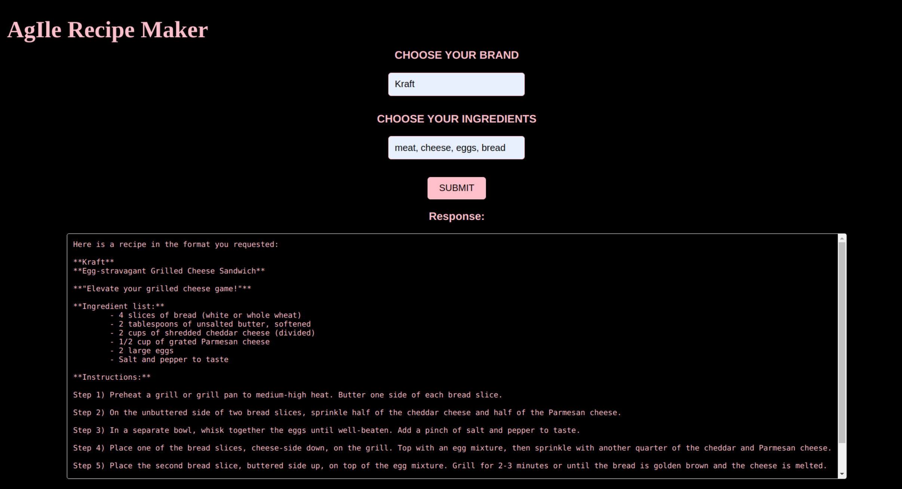

# AgIle Recipe Builder

## Introduction
Ollama Recipe Builder is a web application designed to help users generate creative, brand-themed recipes based on a list of ingredients. By leveraging the powerful language model Ollama, this app provides tailored recipes in a fun and engaging format, making meal preparation easier and more enjoyable. Whether you're a foodie looking for inspiration or a brand aiming to showcase your products through recipes, the Ollama Recipe Builder allows users to select a brand, input ingredients, and receive a customized recipe with detailed instructions.

The app is built using Python's Flask framework and integrates with Ollama's AI capabilities to dynamically generate recipes based on user input. It's designed to be lightweight, easily customizable, and scalable for any user or organization.

## Features
- Dynamic Recipe Generation: Users can input a list of ingredients and select a brand to generate a customized recipe using Ollama's AI model.
- Brand-Themed Recipes: The generated recipes include brand-specific information, making it ideal for companies looking to promote their products through engaging recipes.
- Step-by-Step Instructions: Each recipe includes detailed steps, along with measurements and ingredient lists, for easy-to-follow meal preparation.
- Fun and Engaging Output: In addition to the recipe, each output includes a fun tagline and a structured format to enhance the user experience.
- User-Friendly Interface: A simple and clean web interface allows users to easily input their ingredients and brand selections without hassle.
- Error Handling: Provides graceful error messages if there is an issue communicating with Ollama or processing the request.
- Extensible Architecture: Built on Python and Flask, the app can be extended or modified to support additional features, ingredients, or integrations.

## Installation
1) Install Docker and Git:
    - Ask ChatGPT to walk you through the installition steps for your operating system.
    - Make sure you are properly logged into Docker ('docker login')
    
2) Clone this GitHub repository to your machine:
    - Open a terminal window and run 'git clone https://github.com/jarod4hunt/CSC395_Team-5.git'

3) Run the startup script:
         
    Linux/macOS:                                          
    - cd into CSC395_Team-5/src     
    - run './startup_script.sh'
   
    Windows: 
    - cd into CSC395_Team-5/src
    - run 'docker-compose up --build -d'
    - run 'docker exec -it src-ollama-1 ollama run llama3'  

**This step will take a while the first time it is ran as the AI model is several GBs of data. Subsequent runs will start up very fast.

4) Open 'localhost:5000' in any browser

5) Once open, the browser will ask for a username and password for simple authentication
   - username: csc395
   - password: team5

6) Enjoy!

## System Architecture and Data Flow

## Contributors
Thanks to the following people who have contributed to this project:
<table>
  <tr>
    <td align="center"><a href="https://github.com/jarod4hunt"> <b>@jarod4hunt</b></a></td>
    <td align="center"><a href="https://github.com/hartelaneeqa"> <b>@hartelaneeqa</b></a></td>
    <td align="center"><a href="https://github.com/nickkeller62"> <b>@nickkeller62</b></a></td>
    <td align="center"><a href="https://github.com/anshi0304"> <b>@anshi0304</b></a></td>
    <td align="center"><a href="https://github.com/abdiu1"> <b>@abdiu1</b></a></td>
  </tr>
</table>

## License
This project is licensed under the Apache License.
